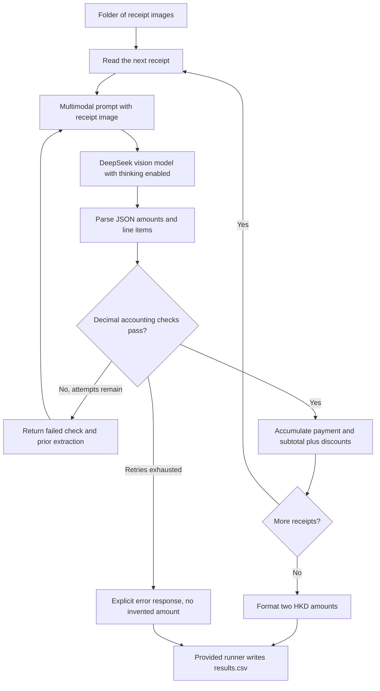

# FTEC5660 Homework 1: Receipt Chain

Build a LangChain pipeline that reads every supermarket receipt in a folder
with the vision-capable DeepSeek Flash model and answers these two questions:

1. How much money did I spend in total for these bills?
2. How much would I have had to pay without the discount?

For this homework, **amount spent** means the final payment after the receipt's
rounding line. **Without the discount** means the sum of the original positive
item prices: add back every promotion, coupon, member, app, packaging-damage,
and percentage discount, but do not add back rounding.

## Student task

Only edit the two functions in `hw1.py` that contain `### YOUR CODE HERE`:

- `build_chain()` creates your LangChain chain.
- `answer_queries()` runs the chain on the receipt images and returns one final
  response for each question.

You may use prompt chaining, routing, parallel calls, reflection, or a
combination. Your final responses should each contain one HKD amount. Do not
hard-code filenames or public answers; grading uses unseen receipt folders.

## Setup and public test

```bash
python3 -m venv .venv
source .venv/bin/activate
pip install -r requirements.txt
```

Put your DeepSeek key after `DEEPSEEK_API_KEY=` in `.env`, then run:

```bash
python3 hw1.py --image-folder public_test
```

The program creates `results.csv` in the current directory. Its columns are
`query`, `model_response`, and `correctness`. The public answers are in
`public_test/ground_truth.json`. The starter intentionally returns the dummy
response `please design your chain to answer these two queries.` so it runs
before you add any API code.

The required model is `deepseek-v4-flash-vision-exp`, the vision-capable
DeepSeek Flash model. JPEG, PNG, GIF, and WebP inputs are accepted by the
homework runner.


## Homework 1 solution: 
The chain processes each receipt independently using a LangChain multimodal
prompt, `ChatDeepSeek(model="deepseek-v4-flash-vision-exp")` with thinking
enabled, and a JSON output parser. It extracts the final payment, subtotal,
signed rounding, positive item line totals, and every individual discount.
Python `Decimal` arithmetic checks that subtotal plus rounding equals payment
and that item totals equal subtotal plus absolute discounts. An inconsistent
extraction is sent back to the same model with the failed accounting check and
the previous result, for at most three extraction attempts per receipt. Once
validated, the amounts are summed across the folder in Python and formatted as
exactly one HKD amount per question. This separates visual interpretation from
exact arithmetic; neither filenames nor ground-truth answers enter the chain.



### Running on Windows PowerShell

Use Python 3.10 or newer. Run these commands from the repository directory:

```powershell
python -m venv .venv
.\.venv\Scripts\python.exe -m pip install -r requirements.txt
# Create .env locally with DEEPSEEK_API_KEY=your_key_here
.\.venv\Scripts\python.exe hw1.py --image-folder public_test
Get-Content results.csv
```

Keep `.env` local; it is covered by `.gitignore`. A valid API key, model access,
available account credit and internet connectivity are required. Each model
request has a 60-second network timeout and at most one SDK retry; extraction
and validation allow up to three attempts per receipt. Persistent API or
validation failures return an explicit error, so the runner can write the CSV.
An error response is not a correct answer, and an API outage cannot be repaired
by this implementation. Startup/configuration failures still need to be fixed.

### Offline tests

```bash
python -m unittest discover -s tests
```

These exercise rounding, multiple discounts, folder aggregation, inconsistent
extractions and explicit failure behavior without spending API credit. Public
receipt accuracy and fresh-clone verification are recorded in `VALIDATION.md`.

